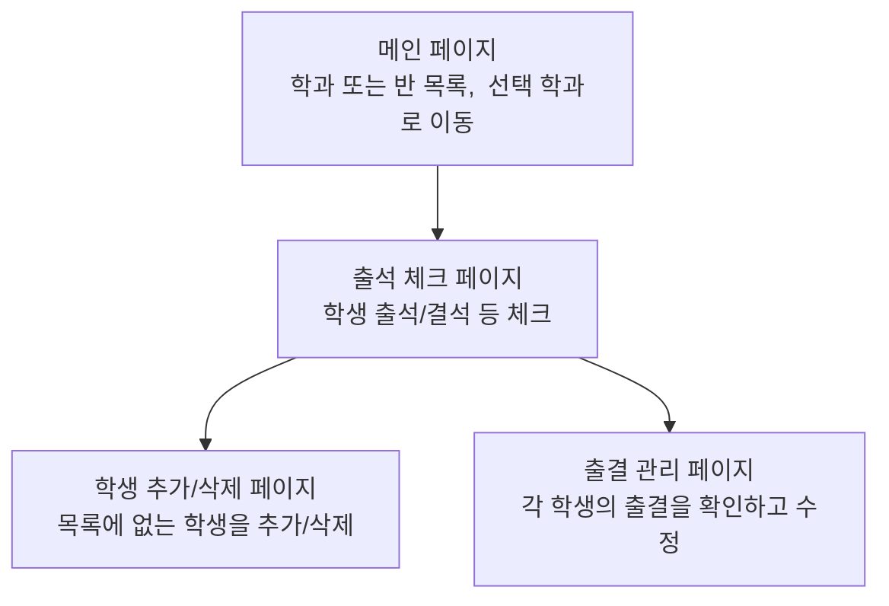

# 2022-Realsense-얼굴인식 출석 프로그램
 
  
인텔 Realsense를 사용한 얼굴인식 출석 프로그램입니다.

# 인증
Realsense를 사용한 여러 인증 방식을 구현하였습니다.

## 얼굴인식
Dlib을 이용하여 얼굴 인식을 진행하는 FaceRecognition모듈을 사용하여 얼굴을 인식합니다.
 [Source](https://github.com/JoKangHyeon/2022-_Realsense-/blob/main/RecogTools/face_recog_withD415.py)  
### 가짜 얼굴 걸러내기

Dlib는 얼굴을 인식할 뿐, 사진속의 얼굴과 실제 얼굴을 구별하지 못합니다.

이를 보완하기 위해 Realsense D415의 깊이 인식 기능을 사용합니다.

Dlib에서 얻어올 수 있는 랜드마크 중에서, 4개의 랜드마크(눈,코,입,볼)를 사용하여 사진인지 아닌지 판별합니다.

1. 코는 눈보다는 앞에 있어야 합니다.
2. 코는 눈보다 최소 2센치는 높아야 합니다.
3. 코는 잎보다는 앞에 있어야 합니다.
4. 얼굴은 최대 30cm의 굴곡을 가집니다.
5. 얼굴은 최소 2cm의 굴곡을 가집니다.

## 정맥 인식
IR빛의 정맥에서의 굴절률 차이를 이용한 정맥 인식 기능 데모를 구현하였습니다.
화면에 왼쪽 위부터 정맥 패턴/깊이/IR/컬러 이미지가 차례로 표시됩니다.

[참고문헌]
Syed W. Shah, Salil S. Kanhere, Jin Zhang, Lina Yao(2020)VID: Human identification through vein patterns captured from commodity depth cameras.
https://ietresearch.onlinelibrary.wiley.com/doi/pdf/10.1049/bme2.12009

 [Source](https://github.com/JoKangHyeon/2022-_Realsense-/blob/main/RecogTools/vein_recog_withD415.py)

# Web
호환성과 Raspbarry PI이식을 위하여 django로 제작하였습니다.

## 메인 페이지

## 출석 체크 페이지

## 학생 추가/삭제 페이지

## 출결 페이지

# 학생 정보 관리
학생정보와 출결정보는 각 폴더에 저장됩니다.
출결은 csv로 저장하며,
학생정보는 json으로 저장됩니다.
